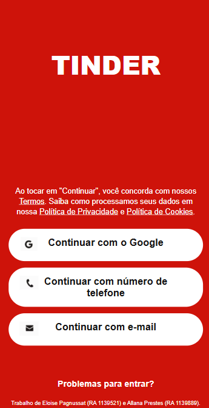

# Clone Tinder — Trabalho G1 Front-End

*Nomes:* Eloise Pagnussat e Allana Prestes  
*RA:* 1139521 e 1139889  
*Disciplina:* Front-End  
*Professor:* Matheus Henrique Barquette  
*Período:* G1

## Site de referência

A tela desenvolvida foi inspirada na tela de login do aplicativo Tinder. Como essa tela não possui uma URL específica para acesso, disponibilizamos abaixo o link para instalação do aplicativo, permitindo a visualização da interface utilizada como referência.
https://apps.apple.com/br/app/tinder-app-de-relacionamento/id547702041

Abaixo na Comparação Visual, também apresentamos as imagens para comparação entre a tela original e a reprodução desenvolvida pela dupla.

## Sobre o projeto

Neste trabalho fizemos uma reprodução da tela de login do Tinder usando HTML e CSS. A ideia foi deixar a página parecida com a original e aplicar os conteúdos vistos em aula, como HTML semântico, CSS, Flexbox, Grid e responsividade.

A tela possui três opções de login: Google, número de telefone e e-mail. Também adicionamos os termos, política de privacidade e cookies, seguindo a organização da página original.

## Checklist — Parte 1

### 1.1 Estrutura HTML

-  Uso de tags como header, main, section e footer.
-  Uso de form para organizar a área de login.
-  Uso de button para os botões.
-  Uso de a para os links.
-  Uso de aria-label.
-  Idioma da página definido como pt-BR.
-  Uso de meta viewport para ajudar na adaptação da página em diferentes telas.

### 1.2 Visual do site

- Fundo vermelho parecido com o Tinder.
- Botões brancos e arredondados.
- Ícones do Google, telefone e e-mail.
- Elementos centralizados na tela.
- Textos de termos, privacidade e cookies.

Algumas coisas ficaram diferentes do site original. O nome "TINDER", por exemplo, foi feito com texto e CSS, e usamos a fonte Arial. Os ícones também foram colocados como imagens dentro do projeto.

Os botões são apenas visuais e não fazem um login de verdade.

### 1.3 CSS

No CSS usamos diferentes tipos de seletores:

- Seletor de elemento: body, button e a
- Seletor de classe: .login-button, .tinder-main e .tinder-footer
- Seletor descendente: .terms-text a e .login-button span
- Pseudo-classe: .login-button:hover, a:focus e button:focus

Também usamos variáveis CSS para algumas cores:

- --tinder-red
- --white
- --button-text

Além disso, usamos margin, padding e box-sizing para ajustar os espaços e tamanhos dos elementos.

### 1.4 Responsividade

- [x] Página feita pensando primeiro no celular.
- [x] Uso de Flexbox.
- [x] Uso de Grid.
- [x] Uso de max-width para controlar o tamanho do conteúdo.
- [x] Media query com min-width: 700px para telas maiores.

Com a media query, alguns tamanhos e espaçamentos mudam quando o site é aberto em uma tela maior.

### 1.5 Personalização

No final da página colocamos nossos nomes e RAs:

Trabalho de Eloise Pagnussat (RA 1139521) e Allana Prestes (RA 1139889).

Essa parte foi adicionada por nós e não existe na página original do Tinder.

## Comparação visual

| Original | Nosso site |
|----------|------------|
|  |  |

## Arquivos

- index.html — estrutura da página
- style.css — aparência e responsividade
- README.md — informações sobre o trabalho

## Pasta assets

A pasta assets guarda as imagens usadas no site, como os ícones do Google, telefone e e-mail. Também pode ser usada para guardar as imagens da comparação entre o site original e o nosso.